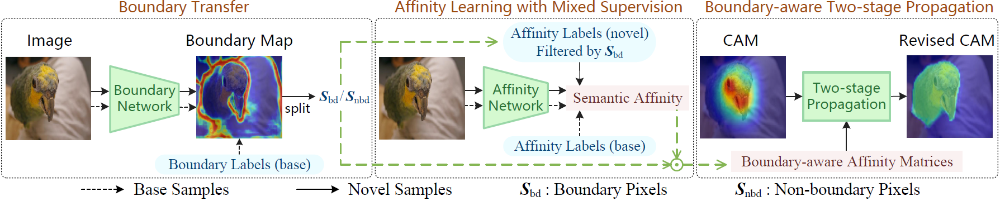

**RETAB**: Weak-shot Semantic Segmentation by Transferring Semantic Affinity and Boundary
========

Official PyTorch Implementation for **RETAB** (**R**egion **E**xpansion by **T**ransferring semantic **A**ffinity and **B**oundary).

> **Weak-shot Semantic Segmentation by Transferring Semantic Affinity and Boundary** [[arXiv]](https://arxiv.org/abs/2110.01519)
>
> Siyuan Zhou, Li Niu*, Jianlou Si, Chen Qian, Liqing Zhang<br>
> Accepted by **BMVC2022**.

# Introduction

In this paper, we show that existing fully-annotated base categories can help segment objects of novel categories with only image-level labels, even if base categories and novel categories have no overlap. We refer to this task as weak-shot semantic segmentation, which could also be treated as WSSS with auxiliary fully-annotated categories. Based on the observation that semantic affinity and boundary are classagnostic, we propose a method called **RETAB** under the WSSS framework to transfer semantic affinity and boundary from base to novel categories. As a result, we find that pixel-level annotation of base categories can facilitate affinity learning and propagation, leading to higher-quality CAMs of novel categories.



This repository takes the initial response (CAM) in [PSA](https://github.com/jiwoon-ahn/psa) as an example to illustrate the usage of our RETAB model. RETAB can be applied to any type of initial response. Since the usage of other initial responses are similar to CAM, we omit them here.


# Model Zoo

<table>
  <thead>
    <tr style="text-align: right;">
      <th>Fold</th>
      <th>Backbone</th>
      <th>Train all-/base-/novel-mIoU of CAM</th>
      <th>Train all-/base-/novel-mIoU of CAM+RETAB</th>
      <th>Weights of RETAB</th>
    </tr>
  </thead>
  <tbody>
    <tr>
      <th>0</th>
      <td>ResNet-38</td>
      <td>48.0/51.4/37.4</td>
      <td>71.2/74.0/62.5</td>
      <td><a href="https://cloud.bcmi.sjtu.edu.cn/sharing/CfOtRjr2e">psa_ourbest_fold0_affnet.pth</a></td>
    </tr>
    <tr>
      <th>1</th>
      <td>ResNet-38</td>
      <td>48.0/47.8/48.8</td>
      <td>71.3/71.2/71.6</td>
      <td><a href="https://cloud.bcmi.sjtu.edu.cn/sharing/8cmkaAkya">psa_ourbest_fold1_affnet.pth</a></td>
    </tr>
    <tr>
      <th>2</th>
      <td>ResNet-38</td>
      <td>48.0/47.2/50.7</td>
      <td>70.9/70.2/73.3</td>
      <td><a href="https://cloud.bcmi.sjtu.edu.cn/sharing/v5nkFdbgB">psa_ourbest_fold2_affnet.pth</a></td>
    </tr>
    <tr>
      <th>3</th>
      <td>ResNet-38</td>
      <td>48.0/47.6/49.4</td>
      <td>70.1/72.4/62.8</td>
      <td><a href="https://cloud.bcmi.sjtu.edu.cn/sharing/uBXcGFnIb">psa_ourbest_fold3_affnet.pth</a></td>
    </tr>
  </tbody>
</table>

We plan to include more models in the future.


# Usage
We provide instructions on how to install dependencies via conda.
First, clone the repository locally:
```
git clone https://github.com/bcmi/RETAB-Weak-Shot-Semantic-Segmentation.git
```
Then, create a virtual environment with PyTorch 1.8.1 (require CUDA >= 11.1):
```
conda env create -f environment.yaml
conda activate retab
```

## Data preparation
Download [PASCAL VOC 2012 development kit](http://host.robots.ox.ac.uk/pascal/VOC/voc2012/) and extra annotations from [SBD](https://www.dropbox.com/s/oeu149j8qtbs1x0/SegmentationClassAug.zip?dl=0). We expect the directory structure of the dataset (denoted by ```${VOC12HOME}```) to be the following:
```
<VOC12HOME>
  Annotations/
  ImageSets/
  JPEGImages/
  SegmentationClass/
  SegmentationClassAug/
```

Then, make some preprocessing:
```
cp VOC2012_supp/* ${VOC12HOME}/ImageSets/SegmentationAug/
cd psa && ln -s ${VOC12HOME} VOC2012 && cd ..
cd RETAB && ln -s ${VOC12HOME} VOC2012 && cd ..
```

Following the category split rule in PASCAL-5i, which is commonly used in few-shot segmentation, we evenly divide the 20 foreground categories into four folds (Fold 0,1,2,3). Categories in each fold are regarded as 5 novel categories, and the remaining categories (including background) are regarded as 16 base categories. We further divide 10582 training samples into base samples and novel samples for each fold. The list of base samples and novel samples can be found at ```RETAB/voc12/trainaug_fold*_base.txt``` and ```RETAB/voc12/trainaug_fold*_novel.txt```, respectively.

## Use [PSA](https://github.com/jiwoon-ahn/psa) to generate & evaluate initial CAM
Download [AffinityNet weights (ResNet-38)](https://drive.google.com/file/d/1xESB7017zlZHqxEWuh1Rb89UhjTGIKOA/view?usp=sharing), and put it under ```psa/best/``` to form ```psa/best/res38_cls.pth```. Then, run:
```
cd psa && sh run_psa.sh && cd ..
```
You could find more details in ```psa/run_psa.sh```.

## Train & infer RETAB to generate pesudo labels, and evaluate them
Download [Mxnet and ResNet-38 pretrained weights](https://github.com/itijyou/ademxapp), and put it under ```RETAB/pretrained_model/``` to form ```RETAB/pretrained_model/ilsvrc-cls_rna-a1_cls1000_ep-0001.params```. Then, make some preparation:
```
cd RETAB
mkdir psa_initcam && cd psa_initcam && ln -s ../../psa/result/psa_trainaug_cam psa_trainaug_cam && cd ..
mkdir psa_afflabel && cd psa_afflabel && ln -s ../../psa/result/psa_trainaug_crf_4.0 psa_trainaug_crf_4.0 && ln -s ../../psa/result/psa_trainaug_crf_32.0 psa_trainaug_crf_32.0 && cd ..
```
and execute:
```
sh run_retab.sh
```
You could find more details in ```RETAB/run_retab.sh```. The default setting is Fold 0. If you want to try other folds, please replace the fouth line of ```RETAB/run_retab.sh``` with ```FOLD=1```/```FOLD=2```/```FOLD=3```.

## Perform mixed-supervised segmentation
Use the ground truth labels of base samples and the generated pesudo labels of novel samples to train a segmentation network in a mixed-supervised manner. In our implementation, we adopt [ResNet-38](https://github.com/peihan-miao/ResNet38-Semantic-Segmentation) as our final segmentation network.


# Acknowledgements
Some of the evaluation codes in this repo are borrowed and modified from [PSA](https://github.com/jiwoon-ahn/psa) and [SEAM](https://github.com/YudeWang/SEAM). Thanks them for their great work.